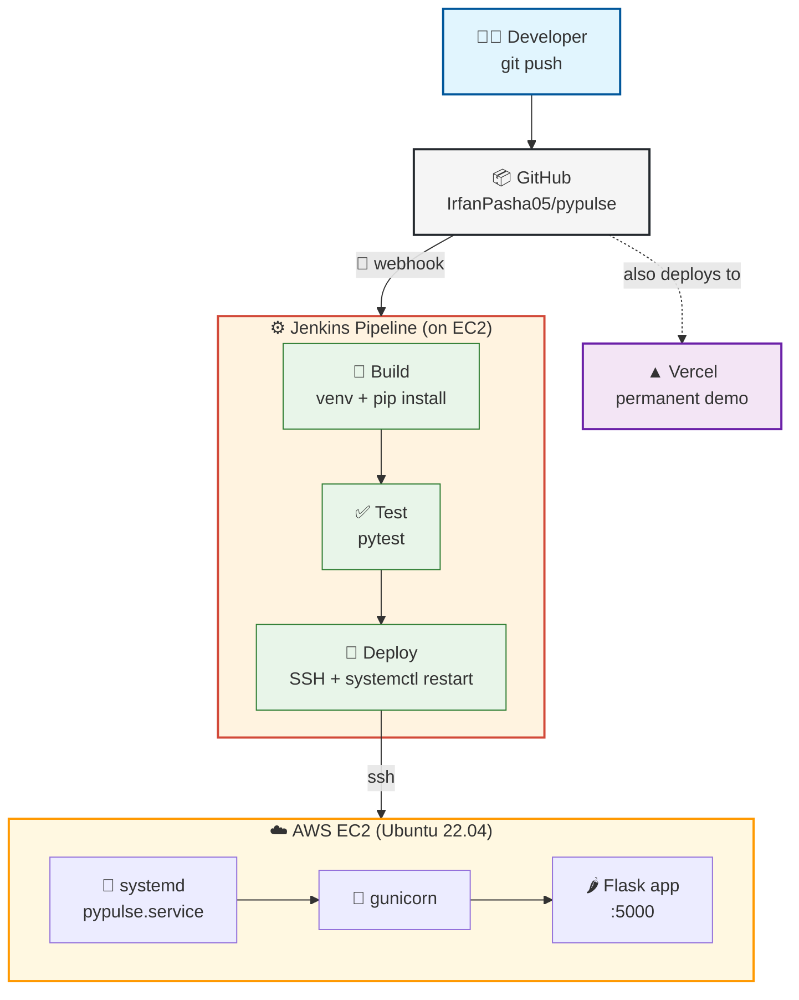
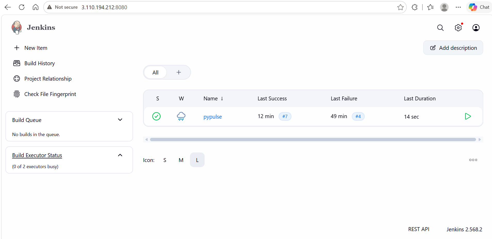
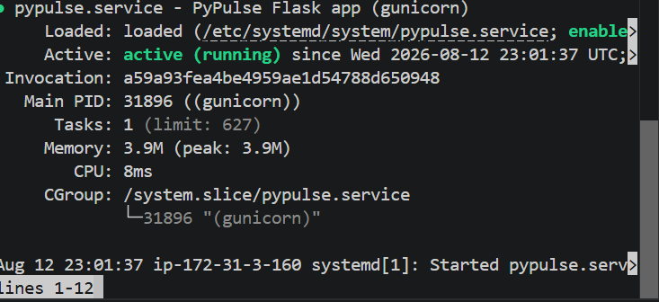
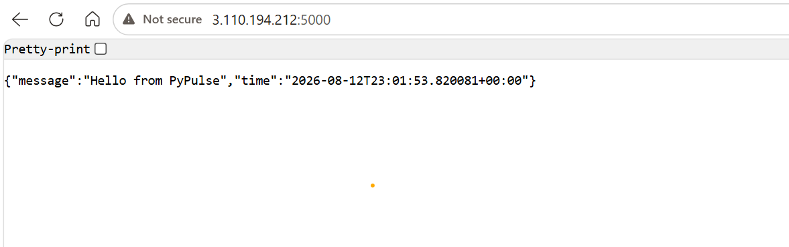
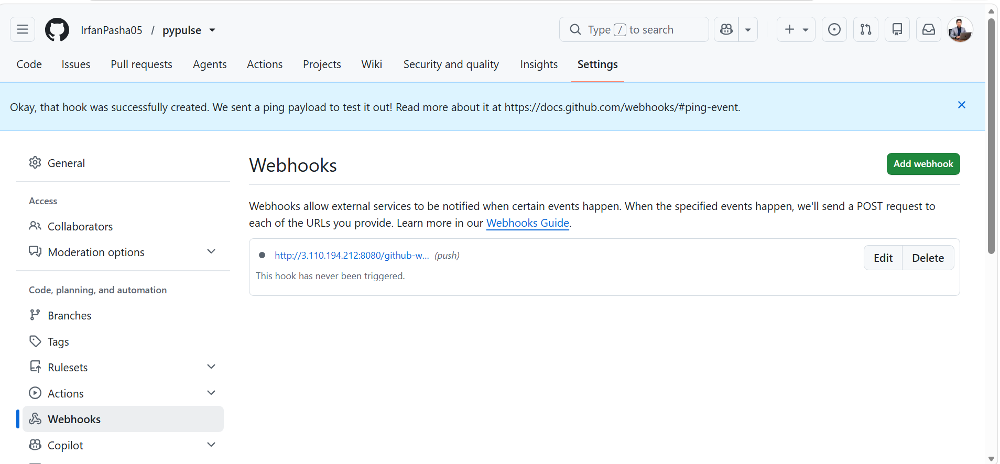
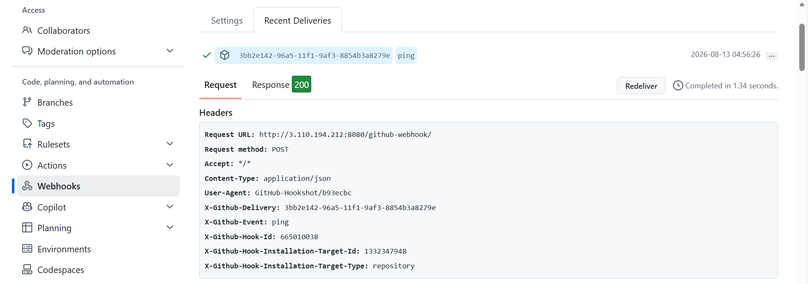
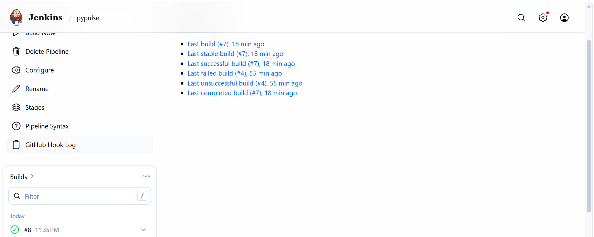
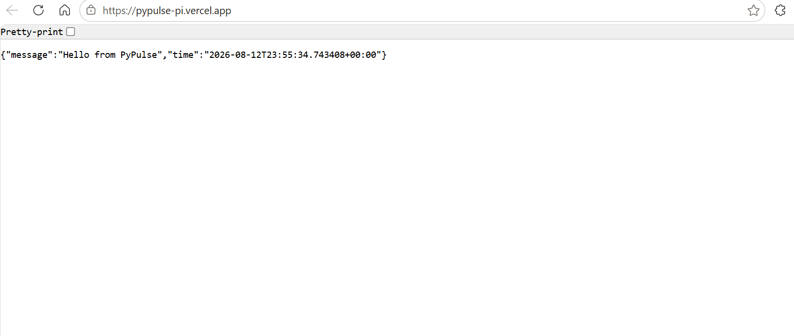
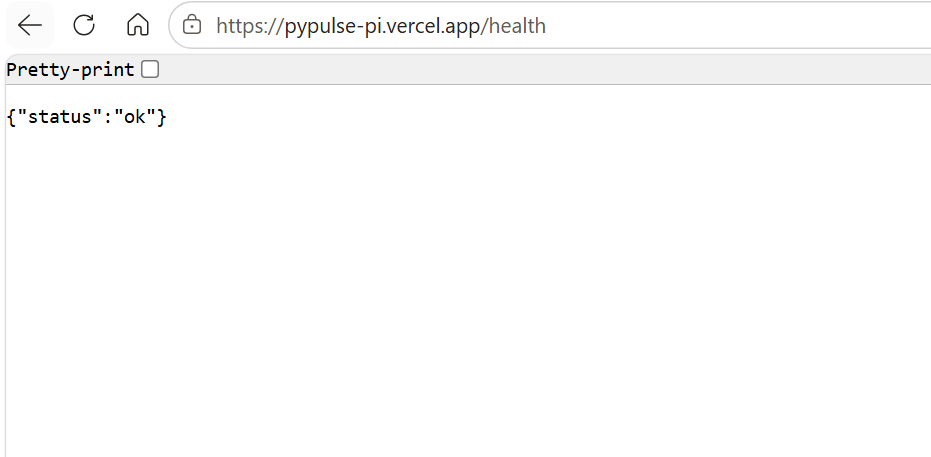

# 🚀 PyPulse

<div align="center">

### A tiny Flask app with a *real* Jenkins CI/CD pipeline behind it

[](https://pypulse-pi.vercel.app)
[](https://www.python.org/)
[](https://flask.palletsprojects.com/)
[](https://www.jenkins.io/)
[](https://aws.amazon.com/ec2/)

[](LICENSE)
[](test_app.py)
[](Jenkinsfile)
[](pypulse.service)

</div>

---

## ✨ What is this?

**PyPulse** is a deliberately small Flask app — the point was never the app itself, it's the **full CI/CD pipeline** wrapped around it:

```
git push  →  GitHub Webhook  →  Jenkins (Build → Test → Deploy)  →  Live on AWS EC2, managed by systemd
```

Every push to `main` is automatically built, tested, and deployed — with **zero manual steps**. A permanent demo is also mirrored on Vercel, since the EC2 instance runs on an AWS free trial and won't live forever. 🌱

🔗 **Try it live:** [pypulse-pi.vercel.app](https://pypulse-pi.vercel.app) · [/health](https://pypulse-pi.vercel.app/health)

---

## 🏗️ Architecture



---

## 🧰 Tech Stack

| Layer | Tool | Purpose |
|---|---|---|
| 🌶️ App | Flask + gunicorn | Web app + production WSGI server |
| ✅ Testing | pytest | Automated route tests, gate before deploy |
| ⚙️ CI/CD | Jenkins (self-hosted on EC2) | Build → Test → Deploy automation |
| 📦 Source control | GitHub | Code + webhook trigger source |
| 🔁 Process manager | systemd | Keeps the app alive across crashes/reboots |
| ☁️ Infrastructure | AWS EC2 (Ubuntu 22.04) | Where Jenkins *and* the app run |
| ▲ Permanent demo | Vercel | Serverless mirror, independent of EC2 |

---

## 📸 Screenshots

<table>
<tr>
<td width="50%">

**Jenkins Dashboard**

*Publicly reachable on the EC2 public IP — build history for the `pypulse` job.*

</td>
<td width="50%">

**systemd Managing the App**

*`pypulse.service` — active, auto-restarting, survives reboots.*

</td>
</tr>
<tr>
<td width="50%">

**App Live on EC2**

*JSON response served by gunicorn, deployed by Jenkins.*

</td>
<td width="50%">

**GitHub Webhook Configured**

*Push events on `main` notify Jenkins directly.*

</td>
</tr>
<tr>
<td width="50%">

**Webhook Delivery — 200 OK**

*GitHub successfully reaching Jenkins on the EC2 public IP.*

</td>
<td width="50%">

**Auto-Triggered Build**

*Build #8 — started automatically on push, no manual click.*

</td>
</tr>
<tr>
<td width="50%">

**Vercel — Live Home Route**

*Permanent HTTPS demo, independent of EC2.*

</td>
<td width="50%">

**Vercel — Health Check**

*`/health` confirming the serverless deploy works end to end.*

</td>
</tr>
</table>

---

## ⚙️ The Pipeline in Detail

### 🔨 Build
```groovy
stage('Build') {
    steps {
        sh '''
            python3 -m venv venv
            . venv/bin/activate
            pip install -r requirements.txt
        '''
    }
}
```
Runs on the Jenkins host. Fails fast if a dependency is broken — before wasting time on Test or Deploy.

### ✅ Test
```groovy
stage('Test') {
    steps {
        sh '''
            . venv/bin/activate
            pytest
        '''
    }
}
```
Runs `test_app.py` against `/` and `/health`. Broken code never reaches Deploy.

### 🚀 Deploy
```groovy
stage('Deploy') {
    steps {
        sshagent(credentials: ['pypulse-ec2-ssh']) {
            sh '''
                set -e
                timeout 60 ssh -o StrictHostKeyChecking=no ${EC2_USER}@${EC2_IP} "
                    set -e
                    if [ ! -d ${APP_DIR} ]; then
                        git clone https://github.com/IrfanPasha05/pypulse.git ${APP_DIR}
                    fi
                    cd ${APP_DIR}
                    git pull origin main
                    source venv/bin/activate
                    pip install -r requirements.txt
                    sudo systemctl restart pypulse
                "
            '''
        }
    }
}
```
SSHes into EC2 via a Jenkins-stored credential, pulls latest code, and hands the process off to **systemd** — no fragile `nohup`/background-process juggling.

---

## 🐛 Real Bugs Hit Along the Way

> Because a pipeline that "just worked" wouldn't have taught me anything.

| # | Bug | Root Cause | Fix |
|---|---|---|---|
| 1 | `ensurepip is not available` | Jenkins host missing `python3-venv` | `sudo apt install python3.14-venv` |
| 2 | `No such DSL method 'sshagent'` | SSH Agent plugin not installed | Installed plugin + restarted Jenkins |
| 3 | `Could not find specified credentials` | Credential ID referenced but never created | Added SSH credential in Jenkins store |
| 4 | Pipeline "succeeds" but app unreachable | `git pull` assumed repo already existed on server; no `set -e` to catch the silent failure | Self-healing clone-or-pull + `set -e` |
| 5 | Deploy hangs forever, no error | Backgrounded process (`nohup ... &`) chained with `&&` kept the SSH session open | Separated commands, `setsid`, `timeout 60` — then replaced entirely with **systemd** |

---

## 🗺️ Roadmap

- [ ] Containerize with Docker, deploy via Jenkins to ECR/ECS
- [ ] Add a staging environment before production deploy
- [ ] Basic monitoring/alerting on the systemd service
- [ ] Move Jenkins off a free-tier EC2 box onto something persistent

---

## 📄 License

MIT — do whatever you want with this, just don't blame me for the SSH hangs. 😄

---

<div align="center">

**Built while learning DevOps, one broken pipeline at a time.** 🛠️

[Live Demo](https://pypulse-pi.vercel.app) · [Report an Issue](../../issues)

</div>
